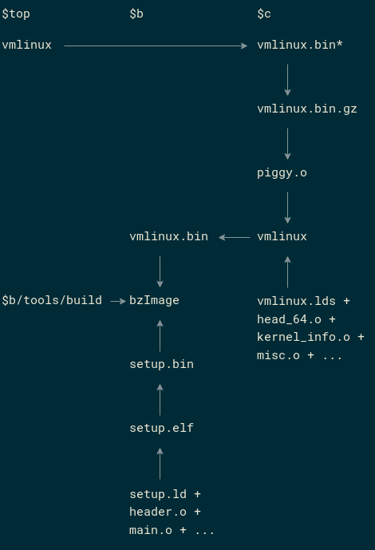
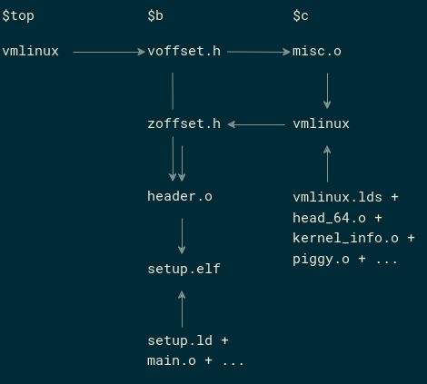

Throughout this discussion I'll use these abbreviations for various directories:
```sh
a=arch/x86
b=$a/boot
c=$b/compressed
```
The final product to be built during kernel compilation is `$b/bzImage`. This is the file that's put in the boot partition and is loaded and run by the bootloader.

`bzImage` is made up of a setup header `$b/setup.bin` and the compressed kernel `$b/vmlinux.bin` (plus a 32-bit CRC at the end). The compressed kernel is in turn made up of the boot code in `$c` and the real kernel, `vmlinux` (in the top build directory), stripped and compressed to `$c/vmlinux.bin.gz`. The real kernel is what would be used for debugging and such. It's the kernel built from all the code except what's in `$b`. It can be built with debug info to be used in gdb+qemu. The following paragraph describes how `vmlinux` finds its way into `$b/vmlinux.bin`.

`vmlinux` is stripped to `$c/vmlinux.bin` (but not converted to binary -- `$/vmlinux.bin` is still a proper ELF file, and the `.bin` extension might be confusing), and compressed to `$c/vmlinux.bin.gz`. As part of its operation, gzip appends the size of the uncompressed kernel at the end. That's then included in binary form in `$c/piggy.S`, which exists solely to "piggyback" the kernel proper in the final `bzImage`. `$c/piggy.o`, assembled from `$c/piggy.S`, is then combined with the other code in `$c` to create `$c/vmlinux` (the compressed kernel), which is then stripped and converted to binary format to `$b/vmlinux.bin` (let's also call this the compressed kernel). The compressed kernel is built as a position independent executable (PIE). The code is mostly 64-bit, except the beginning which is 32-bit.

As stated above, `$b/vmlinux.bin` is concatenated with `$b/setup.bin` to create `$b/bzImage`. This concatenation is done with `$b/tools/build`. The tool also appends a 32-bit CRC at the end, place for which is reserved in `$c/vmlinux.lds.S`.

For the sake of completeness, let's mention that `$b/setup.bin` is created from `$b/setup.elf` by converting it into binary format. `$b/setup.elf` is created from all the code directly under `$b`. This is mostly 16-bit, except the end in `$b/pmjump.S` which is 32-bit.

`$c/vmlinux` is created with the linker script `$c/vmlinux.lds`, which is itself generated from `$c/vmlinux.lds.S` with `gcc -E` (preprocess only). `$b/setup.elf` is created with `$b/setup.ld`.

We haven't said what linker script is used to link the real kernel, `vmlinux`. The real kernel is linked with `$a/kernel/vmlinux.lds`, which is generated from `$a/kernel/vmlinux.lds.S`.

A diagram to summarize some of the above:



Some files in `$c` include headers/source files from `$b`/`$a` to avoid duplicating code. Additionally, `$c/misc.c`, which contains code to decompress the kernel proper, needs to know the size of the uncompressed kernel. For this it includes `$b/voffset.h`. In the same way, `$b/header.S` needs the size of the compressed kernel, for which it includes `$b/zoffset.h`. In general, the prefix `z` is applied to the compressed kernel, and the prefix `v` is applied to the uncompressed kernel. These headers are created from the corresponding kernels (`zoffset.h` from `$c/vmlinux`, `voffset.h` from `vmlinux`) with `nm` and `sed`. `$c/misc.c` includes the decompression code from `lib/decompress_inflate.c`. It defines `STATIC` before including this file so that its dependencies are in turn included statically.

A diagram to summarize the above paragraph:


